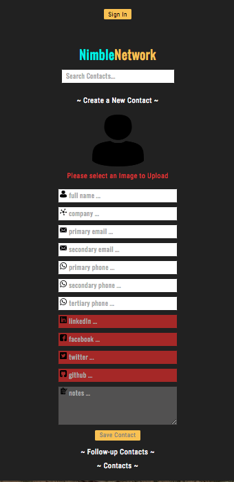

# Nimble Network

[Firebase Nimble Network App](https://nimblenetwork-d13c3.firebaseapp.com/)

An app to keep track of contacts related to people you network with in an industry. Upon signing in through google using Firebase, the user is able to record name, company, email, social media, and phone number of new contacts. The user can also add an image to each contact saved. There is a  toggle on/off “followup” indicator on each contact, which will save those contacts in a “followup” list for quick reference. The application permits multiple options for email, phone, and social media, and allows the user to specify “primary” where applicable. Finally, it includes an option note field for each contact, so that the user can write little reminders.

